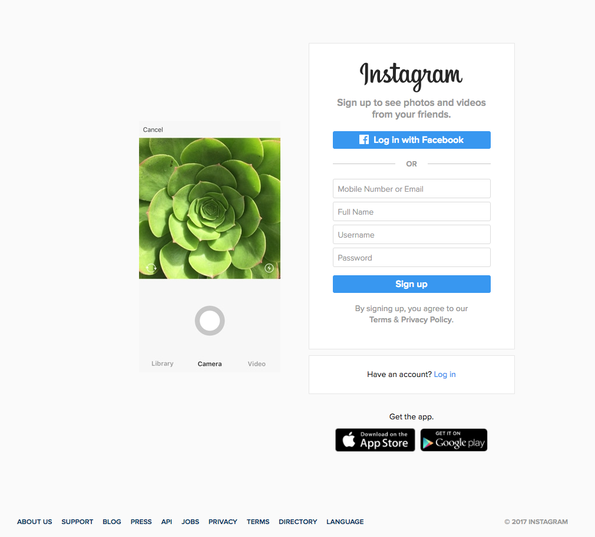

# CSS Lab

## Timings

This lab should take one and two hours.

## Summary

Creating complex looking pages is not as hard as you might think. Recreate the following page using only CSS and HTML.

You can use the developer console in your browser to get colours, pixel sizes and fonts etc from the real site.

## Notes

* Think about the flow of the page. Avoid absolute positioning unless it is completely necessary.
* Keep your CSS as simple as possible. There are very few parts of the page that should require more than three or four lines of CSS.
* Keep your HTML simple. Think about how you could split the page in to blocks.

